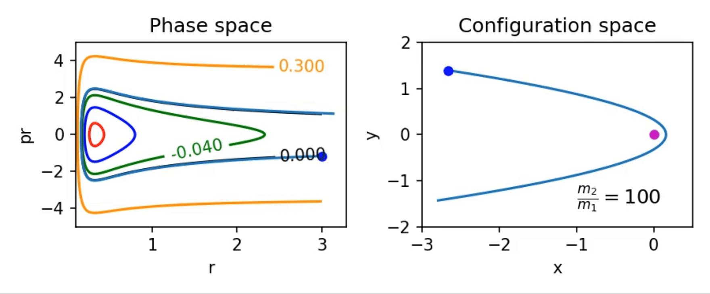
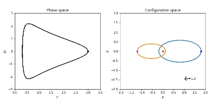

# Two body dynamics using Hamiltonian formalism

## Overview

This repository contains educational materials focused on theoretical physics, specifically covering topics in Hamiltonian mechanics and two-body problems. The content is designed for advanced undergraduate or graduate-level physics courses.

## Contents

### Jupyter Notebooks

- **`Two_body_Hamiltonian_formalism.ipynb`** - A comprehensive notebook covering the mathematical formalism of two-body problems using Hamiltonian mechanics, along with visualisations

### Sample visualisations





- 

## Topics Covered

### Hamiltonian Formalism
- Introduction to Hamiltonian mechanics
- Canonical transformations
- Hamilton's equations of motion
- Phase space analysis
- Conservation laws and symmetries

### Two-Body Problems
- Classical two-body dynamics
- Reduced mass formalism
- Central force problems
- Orbital mechanics
- Scattering theory fundamentals

## Prerequisites

To fully understand the material in this repository, students should have:

- Strong background in classical mechanics (Lagrangian formalism)
- Proficiency in multivariable calculus and differential equations
- Linear algebra knowledge
- Basic understanding of mathematical physics methods

## Getting Started

### Installation Requirements

```bash
# Required Python packages
pip install jupyter numpy matplotlib scipy sympy
```

### Running the Notebooks

1. Clone the repository:
```bash
git clone https://github.com/suchitakulkarni/lecture.git
cd lecture/lecture
```

2. Start Jupyter Notebook:
```bash
jupyter notebook
```

3. Open `Two_body_Hamiltonian_formalism.ipynb` and follow along with the material

## Learning Objectives

After working through this material, students should be able to:

- Apply Hamiltonian mechanics to solve two-body problems
- Understand the relationship between Lagrangian and Hamiltonian formulations
- Analyze phase space trajectories
- Apply conservation laws to simplify complex problems
- Understand the mathematical foundations of classical mechanics

## Additional Resources

### Recommended Textbooks
- Goldstein, H. "Classical Mechanics" (3rd Edition)
- Landau, L.D. & Lifshitz, E.M. "Mechanics"
- Taylor, J.R. "Classical Mechanics"

### Online Resources
- [MIT OpenCourseWare - Classical Mechanics](https://ocw.mit.edu/courses/physics/)
- [Physics Stack Exchange](https://physics.stackexchange.com/) for questions and discussions

## Usage

This material is intended for:
- Physics students studying classical mechanics
- Self-learners interested in theoretical physics
- Educators looking for computational examples of Hamiltonian mechanics
- Researchers needing review of fundamental concepts

## Contributing

If you find errors or have suggestions for improvements:
1. Create an issue describing the problem or enhancement
2. Submit a pull request with proposed changes
3. Ensure all code examples run correctly before submitting

## License

Please check the repository's license file for usage rights and restrictions.

## Contact

For questions about the content or technical issues, please create an issue in this repository.

---

**Note**: This repository is primarily educational. While the physics content is rigorous, always verify results for research applications.
