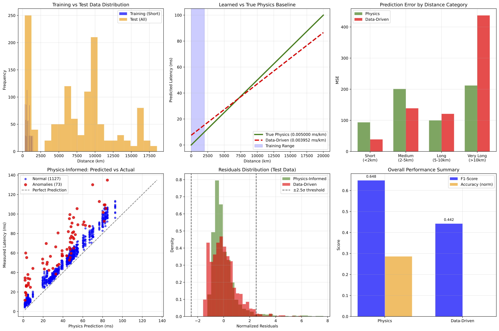

# Physics-Informed ML for Network Latency Anomaly Detection

## Project Summary
This project models network latency between cities by combining physical principles of signal propagation with machine learning techniques. Using linear regression informed by physics to estimate baseline latency, the model analyzes residual delays to detect network anomalies. This approach bridges domain expertise and ML for interpretable network diagnostics.

## Dataset
* Synthetic dataset simulating network latency between city pairs.

* Instrumental noise and injected anomalies simulate real-world network conditions.

## Methodology
* Calculated physical minimum latency based on city distances.
* Applied linear regression to predict expected latency from distance.
* Computed residuals (measured - predicted latency) to identify deviations.
* Evaluated regression performance via R² score and classification accuracy for anomalies.

## Results
* Residual analysis flagged anomalies exceeding 2σ from prediction.
* Visualization examples included showing predicted vs actual latency and anomaly flags.

# How to Run
Clone the repository:

git clone https://github.com/suchitakulkarni/DataScience/tree/main/Physics_Informed_Latency_Prediction

cd Physics_Informed_Latency_Prediction

Create and activate Python environment:

pip install -r requirements.txt

Run the notebook for analysis with a simplistic dataset where ground truth (fibre cable length) is known:

jupyter notebook notebooks/Linear_regression_vs_physics.ipynb

Run the main.py for analysis with more realistic dataset where ground truth (fibre cable length) is unknown:

python main.py

To generate the data used by main.py use

python generate_data.py

# Future Work
* Benchmark against different ML models and develop test scenarios.
* Extend physical model to include routing hops, protocol effects, and ISP metadata.
* Apply Bayesian methods for uncertainty quantification and interpretability.
* Validate on real network latency datasets.

# Technologies
* Python
* pandas, numpy, scikit-learn
* matplotlib
* Jupyter Notebook
